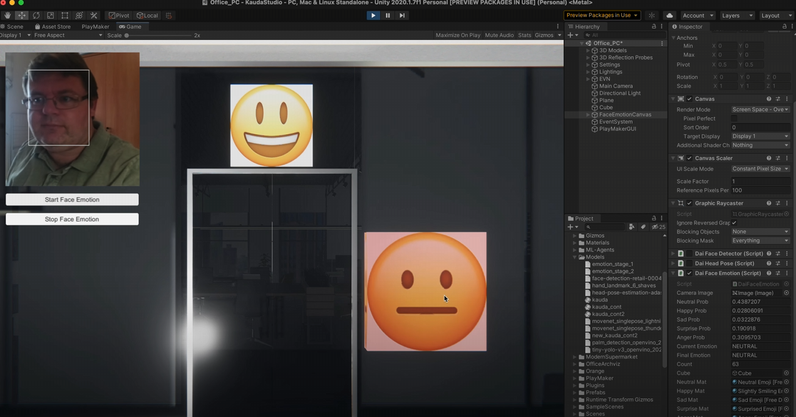
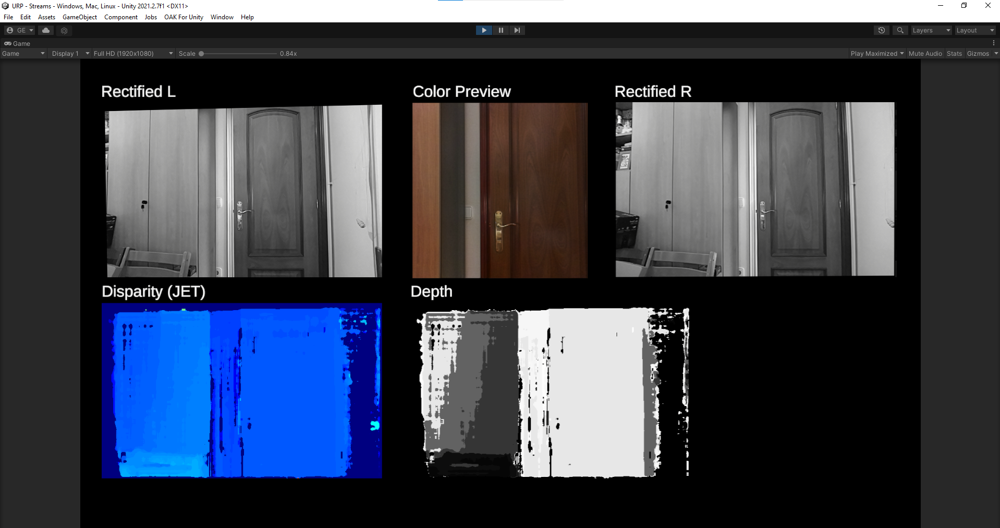

# OAK For Unity

&nbsp;

&nbsp;

&nbsp;

&nbsp;

&nbsp;

&nbsp;

## Power Your Unity Projects with Advanced Spatial AI Using OAK 
### Elevate Unity Development with OAK: Advanced AI and Computer Vision

  
   

### Versatile Application Support: Enables a broad range of applications, from interactive installations and games to health and sports monitoring, VR experiences, and more

  
   

### Ready-to-Use AI Models: Provides a high-level API with a variety of pretrained models for rapid deployment of AI features like face and emotion recognition, and object detection.

  
   

### Comprehensive Sensor Data Access: Provides access to OAK device streams including RGB, mono images, depth, and IMU data, enhancing the sensory input for Unity developers

  
   

### Streamlined Integration: Easy installation from the GitHub repository with Unity project example, and coming soon on the Unity Asset Store.

---

Do you want to know more details and get started ? Check information [here](docs/README.md)