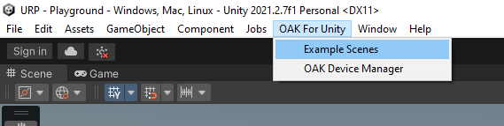

# OAK For Unity

  
  &nbsp; &nbsp;
  
  &nbsp; &nbsp;
   

&nbsp;

&nbsp;

&nbsp;

&nbsp;

&nbsp;

&nbsp;

> `OAK For Unity` is in active development. Its features and API are subject to significant change as development progresses. For beta testing checkout `beta` branch.

## Current status (change log): 
2022-01-19: Demo menu scene added. Now it's much easier to navigate throught the demos. Go to menu on top: "OAK For Unity"->"Example scenes" and hit play

Expand to read more ...

2022-01-14: Device manager, basic streams and point cloud for WINDOWS. Working on rest platforms (MacOS/Linux)

**[What is OAK For Unity? (Click here for more detail)](docs/What_is.md)**

OAK For Unity is native plugin for Windows, Linux and MacOS (Android support ongoing) to enable OAK devices and capabilities inside Unity.
Main goal is bring the power of OAK devices, CV and Edge AI to Unity community to build the next generation of Spatial AI / Edge AI applications.

Expand to read more ...

**OAK For Unity Creators:** Build interactive videogames and experiences with pretrained models and high-level API

**OAK For Unity Developers:** Productivity tools for Unity developers: VR workflows, MoCap tools (body pose and face mesh)

**OAK For CV/AI/Robotics Developers**: Virtual sensors, simulation, custom pipelines, ROS integration, synthetic dataset generation with automatic labelling, Deep RL, ...

This repository contains everything you need to integrate OAK with Unity.

- Unity projects and examples
- depthai-unity C/C++ library (source code and precompiled binaries)
- .unitypackage to easy import OAK For Unity into your project (Coming soon)
- **Notice** there is no C# wrapper available at this moment. We plan to do partial C# wrapper of depthai-core library in the future.

---

## Help build the roadmap checking out our **[Roadmap discussion](https://github.com/luxonis/depthai-unity/issues/1)** and feel free to explain about your use case.

# OAK For Creators. Unity plugin and pretrained models.

## Getting started

**[Quick Installation Instructions](docs/Quick_install.md)**

Get your local workspace up and running quickly (less than 30 secs)

**[OAK For Unity](OAKForUnity/README.md)**

Everything related to OAK For Unity package, projects and demo scenes.

This repo contains precompiled versions of depthai-unity library lowering any entry barrier, so you don't need to deal with C/C++ compilation.

**[Prebuild Unity demos](prebuild_demos/README.md)**

Do you want to try some of our demos?

Do you need to update depthai-unity? Do you want to integrate your own pipeline using depthai-unity library? We got you covered on the following section.

## Building depthai-unity (OPTIONAL)

**[Building depthai-unity library - Coming soon]()**

Detailed instructions covering all steps to build depthai-unity C/C++ library (based on depthai-core C++ library) for all the platforms

**[Tutorial: Integrating your own pipeline inside Unity - Coming soon](https://github.com/luxonis/depthai-unity)**

Step-by-step tutorial how to integrate your own pipeline inside Unity. Please check how to [build depthai-unity library]() first if you didn't.

**[FAQ - Coming soon](https://github.com/luxonis/depthai-unity)**

Check out our FAQ for a list of common questions, tips, tricks, and some sample code.

## Documentation

In-depth documentation on individual components of the package

## Community and Support

If you run into any other problems with the OAK For Unity or have a specific feature request, please submit a **[GitHub issue](https://github.com/luxonis/depthai-unity/issues)**.

## Example projects

- HDRP project ([Coming soon](https://github.com/luxonis/depthai-unity))
- URP project ([Coming soon](https://github.com/luxonis/depthai-unity))
- Integration with Unity Perception package for synthetic dataset with automatic labelling ([Coming soon](https://github.com/luxonis/depthai-unity))
- Integration with Unity Robotics Hub package and ROS ([Coming soon](https://github.com/luxonis/depthai-unity))

## Compatibility

| Platform     | Unity       | Render Pipeline |
| ------------ | ----------- | --------------- |
| Win10        | 2021.2.7f1  | ALL             |
| MacOS        | Coming soon | ALL             |
| Linux Ubuntu | Coming Soon | ALL             |

## Known issues

If you just use the precompiled depthai-unity library inside Unity, be sure you're using latest version.

## Related links

- [Discord](https://discord.gg/4hGT3AFPMZ)
- [Unity forum](https://forum.unity.com/threads/oak-for-unity-spatial-ai-meets-the-power-of-unity.1205764/)
- [Youtube playlist](https://youtu.be/CSFOZLBV2RA?list=PLFzqMMJPSNSbsHp7QeJpOHrZu_1BAdDms)

## License

OAK For Unity is licensed under MIT License. See [LICENSE](LICENSE.md) for the full license text.
