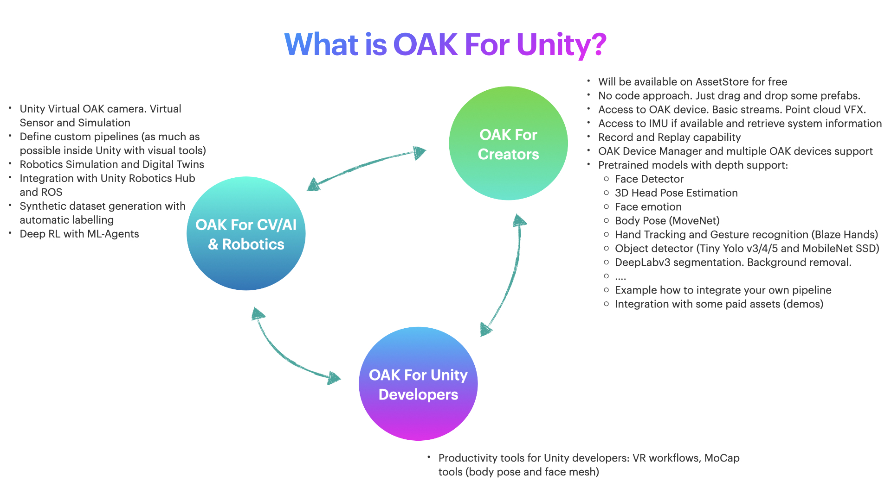
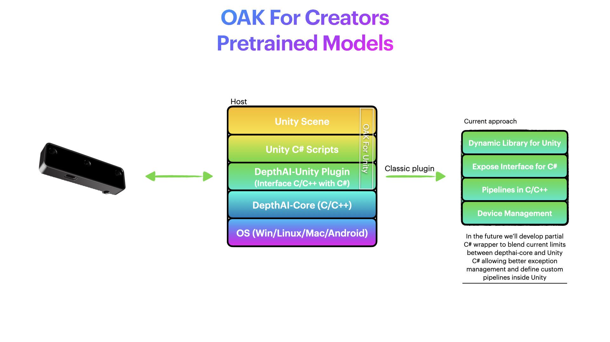

# What is OAK For Unity?

OAK For Unity is native plugin for Windows, Linux and MacOS (Android support ongoing) to enable OAK devices and capabilities inside Unity.
Main goal is bring the power of OAK devices, CV and Edge AI to Unity community to build the next generation of Spatial AI / Edge AI applications.

**OAK For Unity Creators:** Build interactive videogames and experiences with pretrained models and high-level API

**OAK For Unity Developers:** Productivity tools for Unity developers: VR workflows, MoCap tools (body pose and face mesh), Android support. Integration with AR.

**OAK For CV/AI/Robotics Developers:**

- Unity Virtual OAK camera
- Define custom pipelines (as much as possible inside Unity with visual tools)
- Robotics Simulation and Digital Twins
- Synthetic dataset generation with automatic labelling
- Deep RL with ML-Agents
- OpenCV and PCL support inside Unity
- End-to-end workflows for synthetic dataset generation, training and deploy
- Integration with Unity Robotics Hub (ROS) / SystemGraph / SensorSDK
- Integration with Unity Simulation and Unity Simulation Pro

## OAK For Creators

- No code approach. Just drag and drop some prefabs.
- Access to OAK device. Basic streams and point cloud VFX.
- Access to IMU if available and retrieve system information
- Record and Replay capability
- OAK Device Manager and multiple OAK devices support

- High-Level API - Unlock “Myriad” applications with predefined and ready-to-use pretrained models (with depth support if you run OAK-D family)
  - Face Detector
  - 3D Head Pose Estimation
  - Face emotion
  - Body Pose (MoveNet)
  - Hand Tracking and Gesture recognition (Blaze Hands)
  - Object detector (Tiny Yolo v3/4/5 and MobileNet SSD)
  - DeepLabv3 segmentation. Background removal.
  - Depth (only OAK-D family) - point cloud visualization
  - Example how to integrate your own pipeline
  - Integration with some paid assets (demos)
  - Face mesh and Face animation tool
  - Humanoid support with Body pose
  - Eye-gaze
  - OCR
  - More advanced demos: combining different pretrained models

# Next Steps

**[Ready for getting started? Click here! ](Quick_install.md)**
